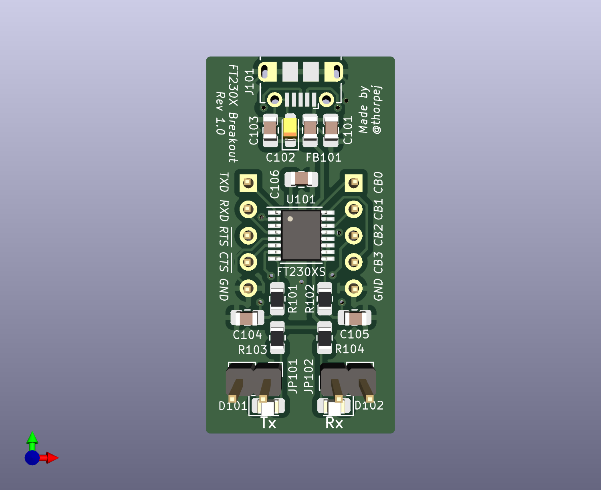

# A Basic FTDI FT230X Breakout Board

This is a fairly straight-forward breakout board for the FTDI FT230X
USB UART.  The circuit is more-or-less the example bus-powered circuit
in the FT230X data sheet, and all of the I/O pins are simply brought
out to pin headers.  You can point them down for inserting into a breadboard,
or you can point them up for connecting with Dupont wires.  The board is
pretty small, so there are no mounting holes.

This work is licensed under the [Creative Commons Attribution
ShareAlike 4.0 International license](https://creativecommons.org/licenses/by-sa/4.0/).

At the time I designed this, the FT230X was the simplest of FTDI's USB UARTs.
It has *TXD*, *RXD*, *RTS*, and *CTS* serial signals, plus four general purpose
I/O pins that have several available functions (see the data sheet).  The
default configuration for two of those pins is to drive transmit and receive
LEDs, and so I went ahead and included those LEDs on the board along with
jumper headers to enable them.  If the jumpers are not installed, then the
two pins (*CB1* and *CB2*) are completely isolated from the LEDs, so they are
safe to use for whatever purpose you wish.

I designed and built this board mainly as a learning experience; I am planning
to use the FT230X in some other projects, and wanted to prove to myself that
I could do the necessary PCB layout and assembly work the part requires.  I'm
absolutely positive that better design is possible, but I'm just a hobbyist
with middle-aged-guy eyesight, so this is what you get!  :-)

## How to build it

With the exception of the pin headers, everything on this board is
surface-mount, so you will need to be comfortable with surface-mount
soldering.  The FT230XS is probably going to be the trickiest part to
solder, followed by the micro USB connector.  Both of those should be
fairly doable with both paste and hot air or drag soldering (and the
USB connector has through-holes for mounting).  There are lots of
surface-mount soldering tutorials on YouTube if you want to learn the
various techniques.

All of the surface-mount resistors, capacitors, and LEDs are in 0805 / 2012
packages.

Here are the parts you will need:

* One of the **ft230x-breakout** PCBs.  The Gerber files are provided here
and I have set up a shared project on PCBWay [here](XXX).
* 1 FT230XS USB UART IC in an SSOP-16 package (Mouser part number [**895-FT230XS-R**](https://www.mouser.com/ProductDetail/895-FT230XS-R)).
* 1 Molex 105017-0001 micro USB B connector (Mouser part number [**538-105017-0001**](https://www.mouser.com/ProductDetail/538-105017-0001)).
* 1 4.7uF tantalum capacitor (such as Mouser part number [**647-F951E475MPAAQ2**](https://www.mouser.com/ProductDetail/647-F951E475MPAAQ2)).
* 1 ferrite bead for HF noise suppression on the USB +5V rail.  I just used the
example part listed in the FT230X data sheet (Mouser part number [**875-MI0805K400R-10**](https://www.mouser.com/ProductDetail/875-MI0805K400R-10)).
* 2 100nF ceramic capacitors.
* 1 10nF ceramic capacitor.
* 2 47pF ceramic capacitors.
* 2 270 ohm 1/8W resistors.
* 2 27 ohm 1/8W resistors.
* 2 LEDs.  I like to use green for Tx (such as Mouser part numer [**710-150080GS75000**](https://www.mouser.com/ProductDetail/710-150080GS75000)) and red for
Rx (such as Mouser part numer [**710-150080RS75000**](https://www.mouser.com/ProductDetail/710-150080RS75000)).
* 2 standard 1x5 2.54mm pin headers for the signal connections.
* 2 standard 1x2 2.54mm pin headers and jumper caps for the LED enable jumpers.

A full reference of all components can be found in [ft230x-breakout-bom.pdf](ft230x-breakout-bom.pdf).

Solder the surface-mount parts before soldering the pin headers.  That's all
the assembly advice I'm going to give on this one!

## Errata

* In revision 1.0 of the board, there is a silkscreen error: The Tx and Rx
LED labels are swapped.  This is corrected in revision 1.1.

## Changes

### 1.1

* Corrected the Tx and Rx LED labels on the front silkscreen.

If you have any questions about the board, you can reach out to me on
Twitter (*[@thorpej](https://twitter.com/thorpej)*) or Mastodon
(*[@thorpej@mastodon.sdf.org](https://mastodon.sdf.org/@thorpej)*).  You
can also check out my [YouTube channel](https://www.youtube.com/@thorpejsf),
which has this and other retrocomputing related content.
